# Architecture diagrams

These diagrams show how the parts of Legal Lint connect. They are for persons and for coding agents. Each diagram is Mermaid text. Thus GitHub renders it, and an agent can read it without an image. The text in `CLAUDE.md` is the summary. These diagrams show the sequence of the steps and the location of each decision.

Each diagram names the file that owns the behaviour. **If you change that behaviour, update the diagram in the same commit** (see `CONTRIBUTING.md`). A diagram that does not agree with the code is worse than no diagram.

1. [Packages and their dependencies](#1-packages-and-their-dependencies)
2. [Repo scan: from command to report](#2-repo-scan-from-command-to-report)
3. [How a raw finding gets its status](#3-how-a-raw-finding-gets-its-status)
4. [URL scan: local or hosted](#4-url-scan-local-or-hosted)
5. [Hosted scan request in the API](#5-hosted-scan-request-in-the-api)
6. [The three SSRF layers](#6-the-three-ssrf-layers)
7. [Licence gate](#7-licence-gate)
8. [Data that goes out of the machine](#8-data-that-goes-out-of-the-machine)
9. [Coding agent loop over MCP](#9-coding-agent-loop-over-mcp)
10. [Judgment questions and the content hash](#10-judgment-questions-and-the-content-hash)
11. [Parts of a rule](#11-parts-of-a-rule)
12. [Fixture test harness](#12-fixture-test-harness)

---

## 1. Packages and their dependencies

`core` and `rules` are private. Other packages use them as TypeScript source. tsup bundles them into the CLI. The API imports core only through three subpaths. Thus the TypeScript compiler does not go into the bundle of the API.

## 2. Repo scan: from command to report

`legal-lint scan` and MCP `scan_repo` use the same path. Owners: `cli/src/program.ts`, `cli/src/mcp/server.ts`, `core/src/engine.ts`, `core/src/static/repo-index.ts`.

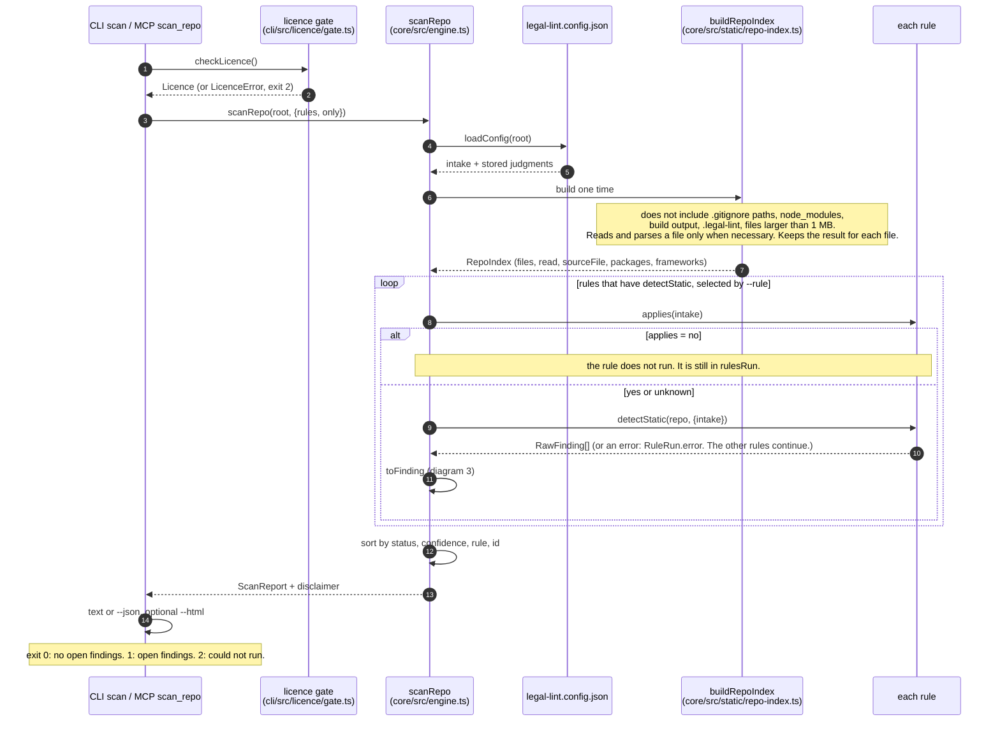

## 3. How a raw finding gets its status

`toFinding` in `core/src/engine.ts`. The sequence is important: missing intake comes before a judgment question. Only `open` findings make the CLI fail.

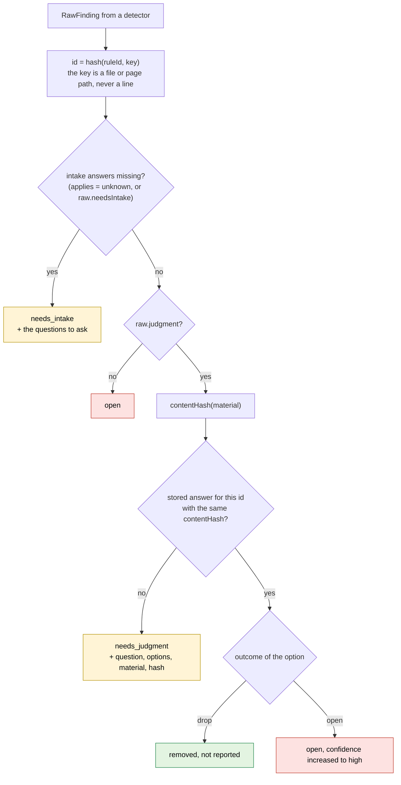

## 4. URL scan: local or hosted

`scanUrl` in `cli/src/scan-url.ts`. The capture can come from the local machine or from the hosted API. In the two cases, **the rules always run on the machine of the user** with the local intake and judgments. The hosted API only records.

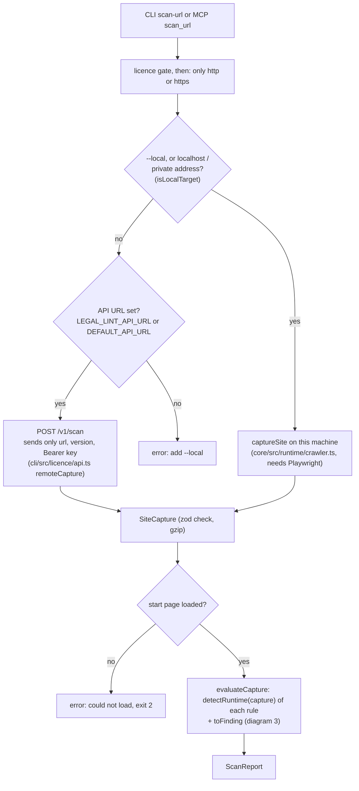

The data that the crawler records, in `captureSite`:

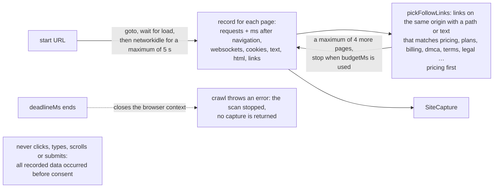

## 5. Hosted scan request in the API

`POST /v1/scan` in `api/src/app.ts`. The refusals that cost little come first. Thus a key or a month that has no more scans does not cause a store read and does not use a queue position. The API counts the usage only immediately before Chromium starts.

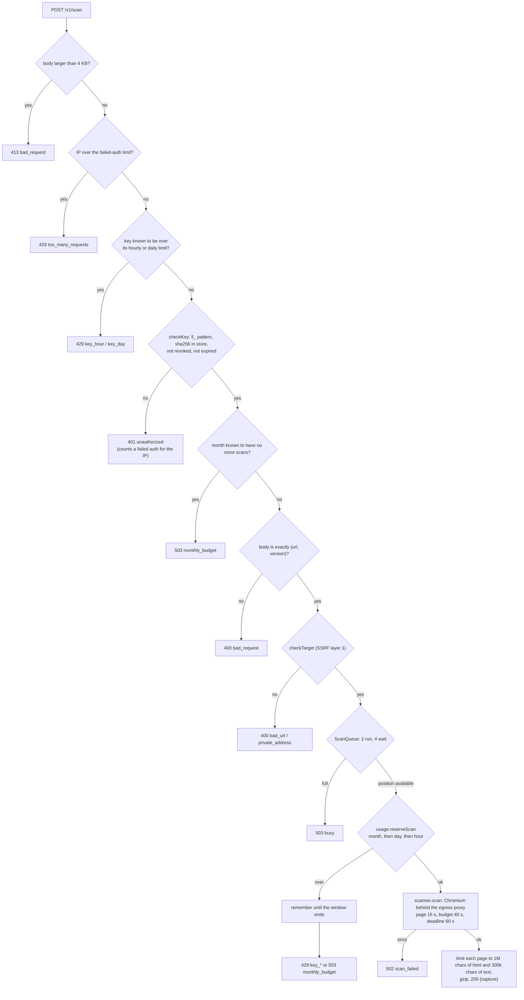

The default numbers come from `api/src/config.ts`. You can change them with environment variables (`packages/api/DEPLOY.md` lists them). `POST /v1/licence` is more simple: the failed-auth block for each IP, 30 checks for each IP for each hour, a strict `{key, version}` body, then `checkKey`.

## 6. The three SSRF layers

The hosted scanner must never connect to an internal address. This is also true for a redirect, a subresource, or DNS that changes its answer. Owners: `api/src/egress/target.ts`, `api/src/egress/proxy.ts`, `api/src/scan.ts`.

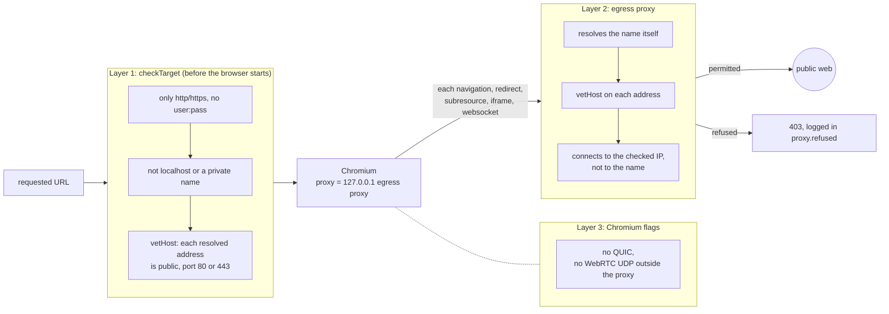

## 7. Licence gate

`checkLicence` in `cli/src/licence/gate.ts`. There is no free tier. Each CLI scan and each MCP tool calls it first. The CLI asks the API a maximum of one time each day for each key.

`legal-lint activate <key>` asks the API first. It keeps the key (mode 0600) only when the key is valid. The key never goes into `legal-lint.config.json`.

## 8. Data that goes out of the machine

This is the privacy promise. `tests/privacy.test.ts` and the strict zod schemas in `core/src/remote.ts` make it mandatory.

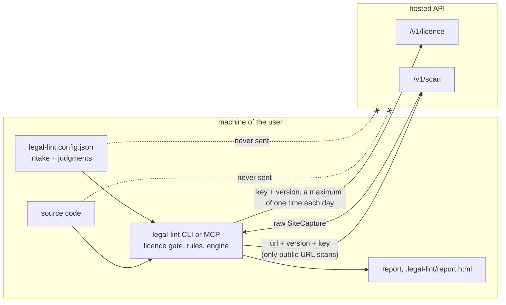

## 9. Coding agent loop over MCP

This is the loop that we expect. It comes from the server instructions in `cli/src/mcp/server.ts`. Each tool checks the licence first. Legal Lint never edits code. The agent edits the code.

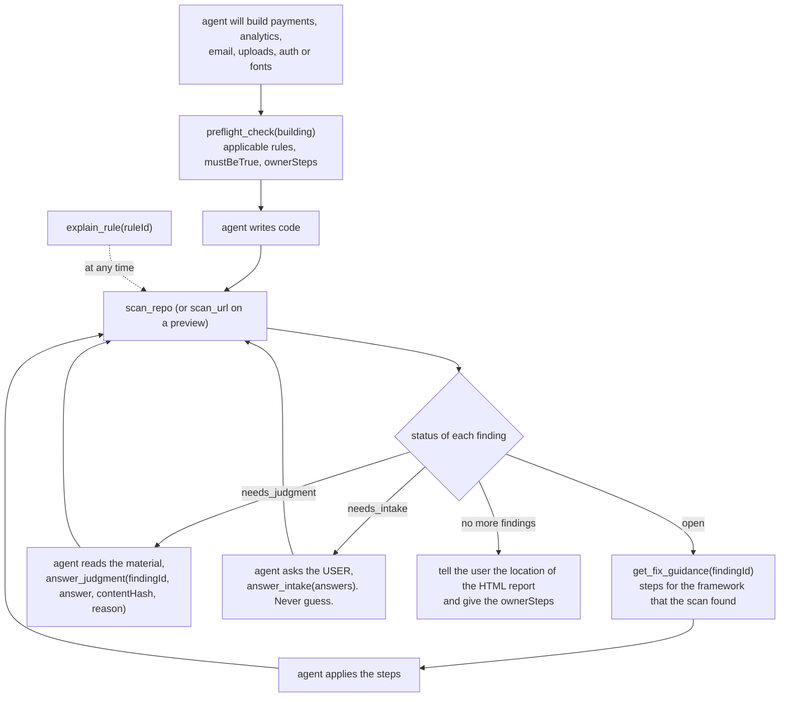

## 10. Judgment questions and the content hash

This diagram shows how `answer_judgment` keeps an answer and why the answer stops being valid automatically. Owners: `core/src/judgments.ts`, `answer_judgment` in `cli/src/mcp/server.ts`.

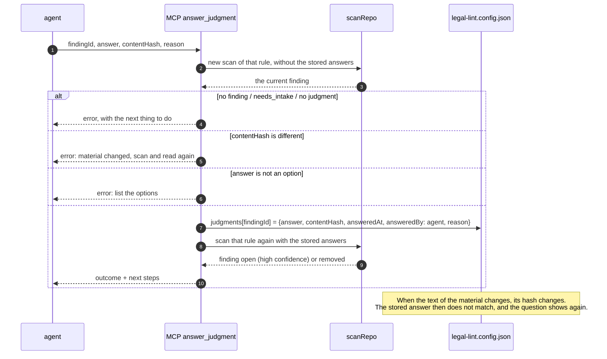

## 11. Parts of a rule

There is one folder for each rule in `packages/rules/src/`. When the rules load, `defineRule` in `core/src/define-rule.ts` validates the YAML. For the full procedure, read `docs/adding-a-rule.md`.

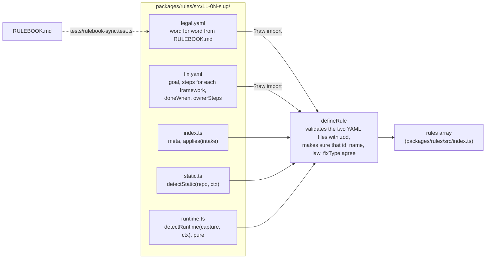

The detectors that each rule has at this time:

| Rule | static | runtime | Notes |
|---|---|---|---|
| LL-01 Google Fonts | yes | yes | |
| LL-02 Marketing email | yes | | cases that are not clear become `needs_judgment` |
| LL-03 Session replay | yes | yes | |
| LL-04 Auto-renewal | yes | yes | |
| LL-05 DMCA agent | yes | | applicability from intake, evidence of absence |

## 12. Fixture test harness

`tests/fixtures.test.ts` finds each folder in `fixtures/<rule>/<name>/`. It tests each folder by the prefix of its name. `tests/fixture-meta.test.ts` makes sure that each rule and mode has sufficient fixtures.

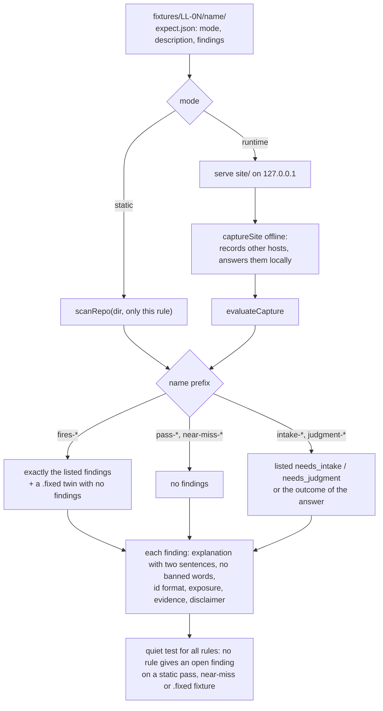
