# Architecture diagrams

Pictures of how Legal Lint fits together, for people and for coding agents. Each diagram is Mermaid text, so GitHub renders it and an agent can read it without an image. The prose in `CLAUDE.md` is the summary; these diagrams show the order of steps and where each decision is made.

Every diagram names the file that owns the behaviour. **If you change that behaviour, update the diagram in the same commit** (see `CONTRIBUTING.md`). A diagram that disagrees with the code is worse than no diagram.

1. [Packages and what they depend on](#1-packages-and-what-they-depend-on)
2. [Repo scan: from command to report](#2-repo-scan-from-command-to-report)
3. [How a raw finding gets its status](#3-how-a-raw-finding-gets-its-status)
4. [URL scan: local or hosted](#4-url-scan-local-or-hosted)
5. [Hosted scan request inside the API](#5-hosted-scan-request-inside-the-api)
6. [The three SSRF layers](#6-the-three-ssrf-layers)
7. [Licence gate](#7-licence-gate)
8. [What leaves the machine](#8-what-leaves-the-machine)
9. [Coding agent loop over MCP](#9-coding-agent-loop-over-mcp)
10. [Judgment questions and the content hash](#10-judgment-questions-and-the-content-hash)
11. [Anatomy of a rule](#11-anatomy-of-a-rule)
12. [Fixture test harness](#12-fixture-test-harness)

---

## 1. Packages and what they depend on

`core` and `rules` are private and consumed as TypeScript source. tsup bundles them into the CLI. The API imports core only through three subpaths, so the TypeScript compiler stays out of its bundle.

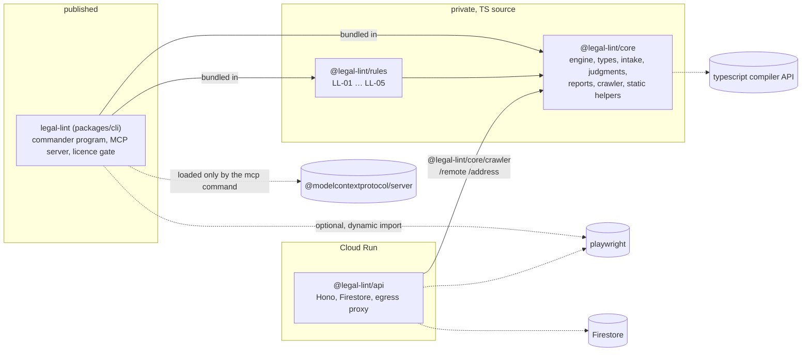

## 2. Repo scan: from command to report

`legal-lint scan` and MCP `scan_repo` take the same path. Owners: `cli/src/program.ts`, `cli/src/mcp/server.ts`, `core/src/engine.ts`, `core/src/static/repo-index.ts`.

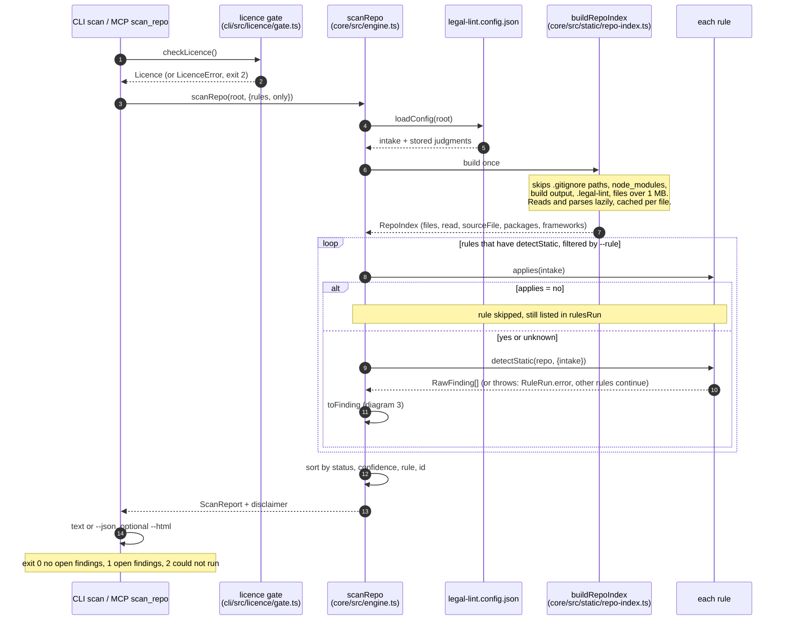

## 3. How a raw finding gets its status

`toFinding` in `core/src/engine.ts`. Order matters: missing intake wins over a judgment question. Only `open` findings fail the CLI.

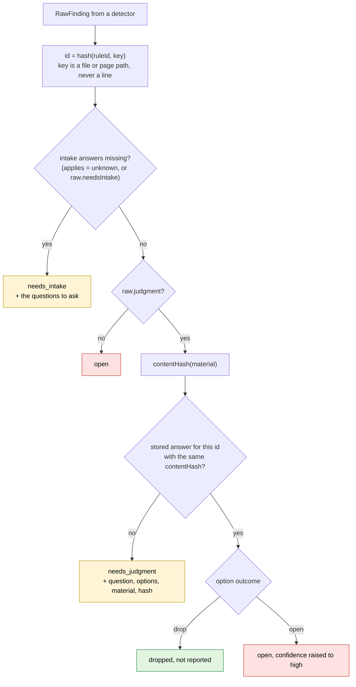

## 4. URL scan: local or hosted

`scanUrl` in `cli/src/scan-url.ts`. Whoever records the capture, **the rules always run on the user's machine** with local intake and judgments. The hosted API only records.

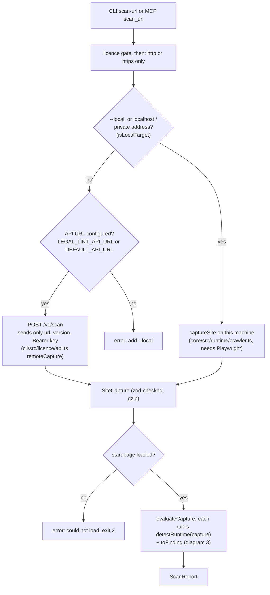

What the crawler records, in `captureSite`:

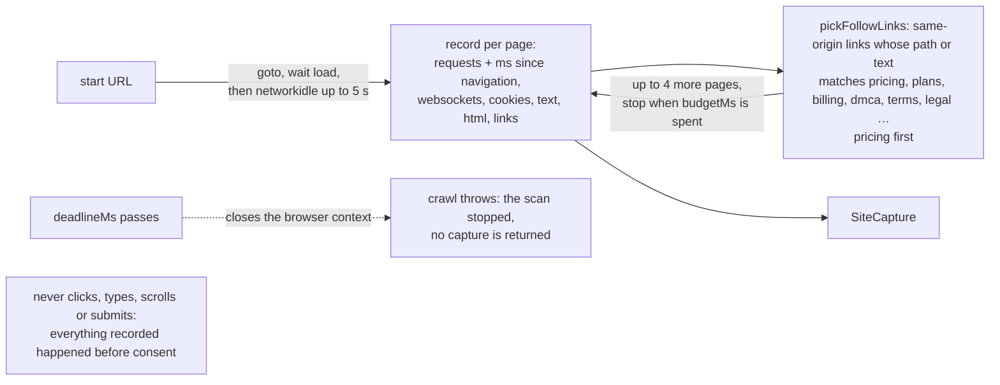

## 5. Hosted scan request inside the API

`POST /v1/scan` in `api/src/app.ts`. Cheap refusals come first, so a spent key or a spent month costs no store read and no queue place. Usage is counted only when Chromium is about to start.

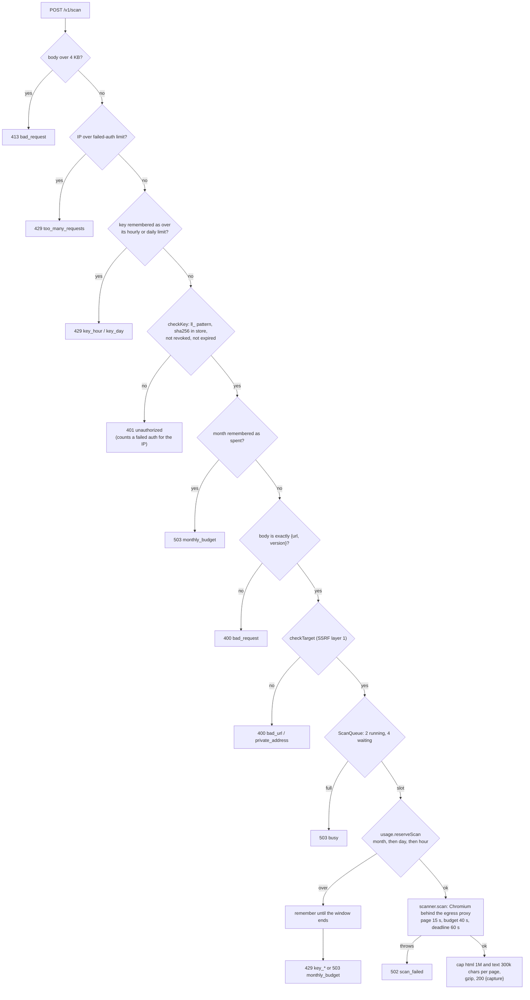

Default numbers come from `api/src/config.ts` and can be changed with environment variables (listed in `packages/api/DEPLOY.md`). `POST /v1/licence` is simpler: IP failed-auth block, 30 checks per IP per hour, strict `{key, version}`, then `checkKey`.

## 6. The three SSRF layers

The hosted scanner must never reach an internal address, even through a redirect, a subresource or DNS that changes its answer. Owners: `api/src/egress/target.ts`, `api/src/egress/proxy.ts`, `api/src/scan.ts`.

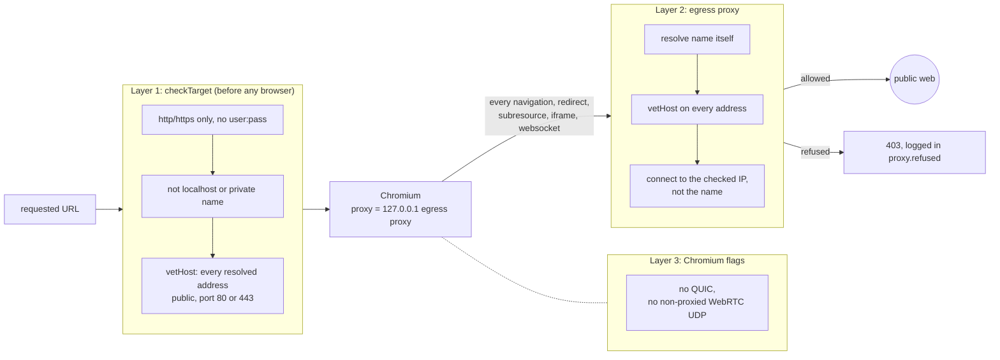

## 7. Licence gate

`checkLicence` in `cli/src/licence/gate.ts`. There is no free tier: every CLI scan and every MCP tool calls it first. The API is asked at most once a day per key.

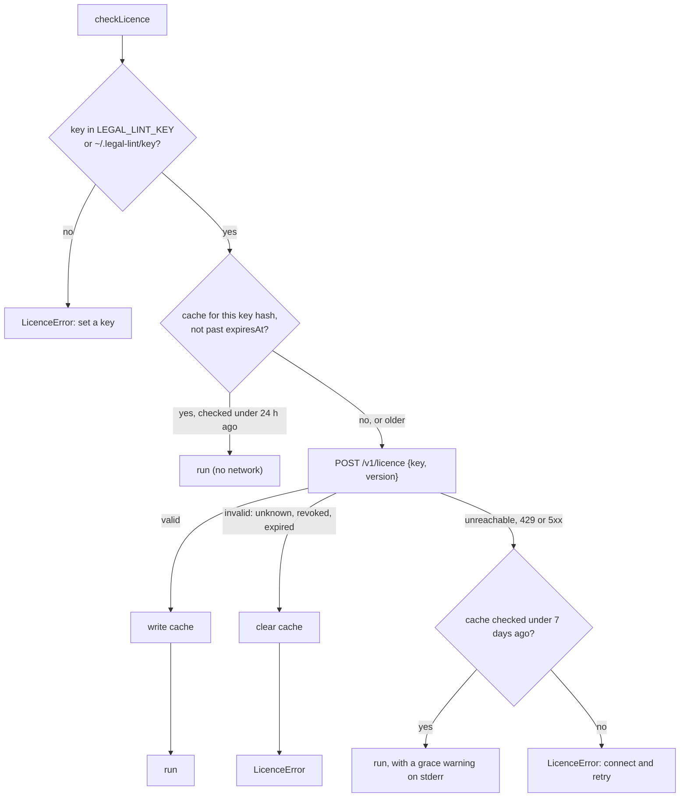

`legal-lint activate <key>` asks the API first and saves the key (mode 0600) only when it is valid. The key never goes into `legal-lint.config.json`.

## 8. What leaves the machine

The privacy promise, enforced by `tests/privacy.test.ts` and the strict zod schemas in `core/src/remote.ts`.

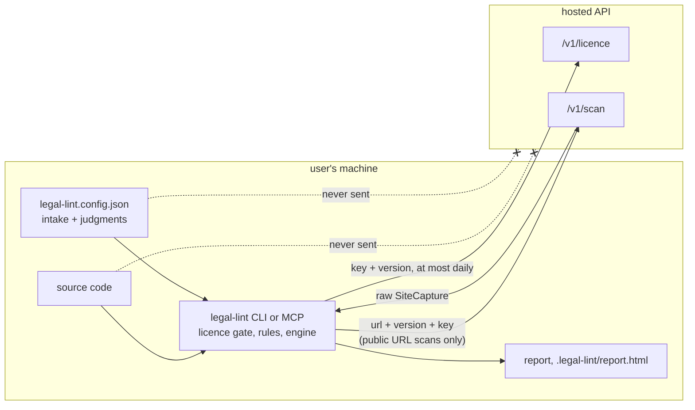

## 9. Coding agent loop over MCP

The intended loop, from the server instructions in `cli/src/mcp/server.ts`. Every tool checks the licence first. Legal Lint never edits code; the agent does.

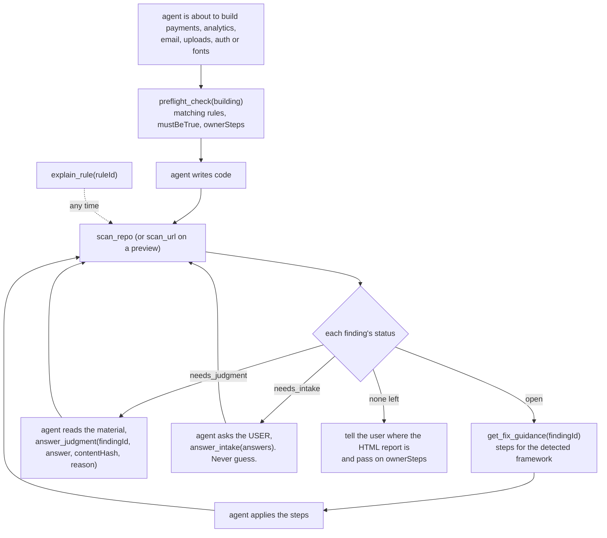

## 10. Judgment questions and the content hash

How `answer_judgment` stores an answer and why it expires by itself. Owners: `core/src/judgments.ts`, `answer_judgment` in `cli/src/mcp/server.ts`.

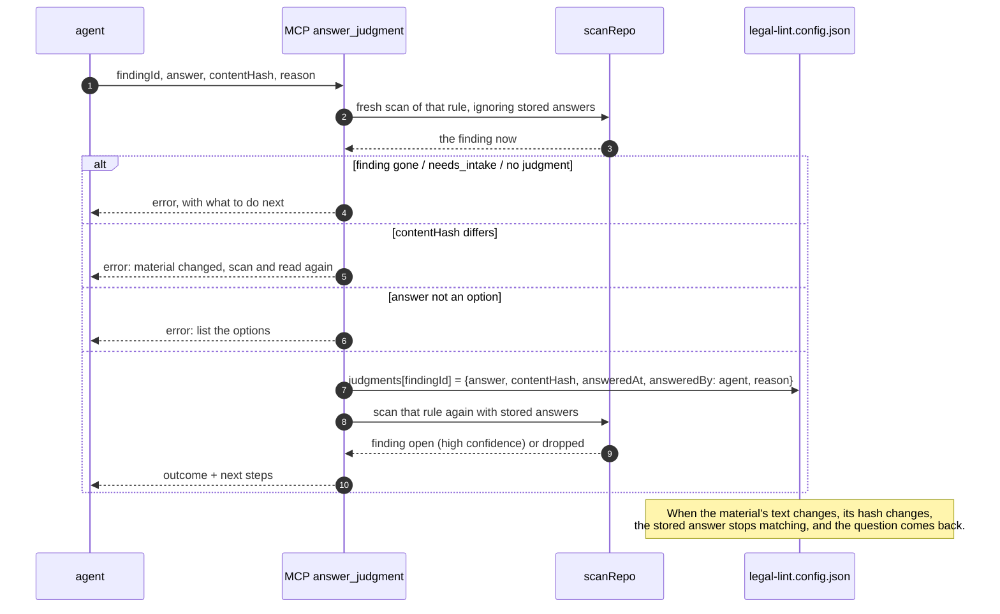

## 11. Anatomy of a rule

One folder per rule in `packages/rules/src/`. `defineRule` in `core/src/define-rule.ts` validates the YAML at load time. Full recipe: `docs/adding-a-rule.md`.

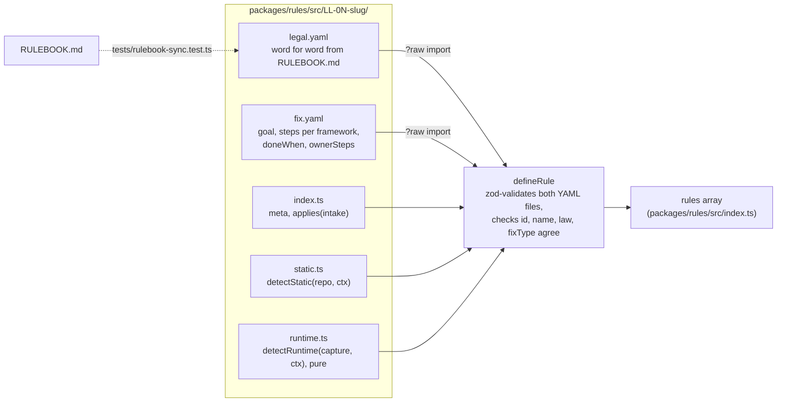

Which detectors each rule has today:

| Rule | static | runtime | Notes |
|---|---|---|---|
| LL-01 Google Fonts | yes | yes | |
| LL-02 Marketing email | yes | | unclear cases become `needs_judgment` |
| LL-03 Session replay | yes | yes | |
| LL-04 Auto-renewal | yes | yes | |
| LL-05 DMCA agent | yes | | intake-driven, absence evidence |

## 12. Fixture test harness

`tests/fixtures.test.ts` finds every folder under `fixtures/<rule>/<name>/` and checks it by its name prefix. `tests/fixture-meta.test.ts` checks that each rule and mode has enough fixtures.

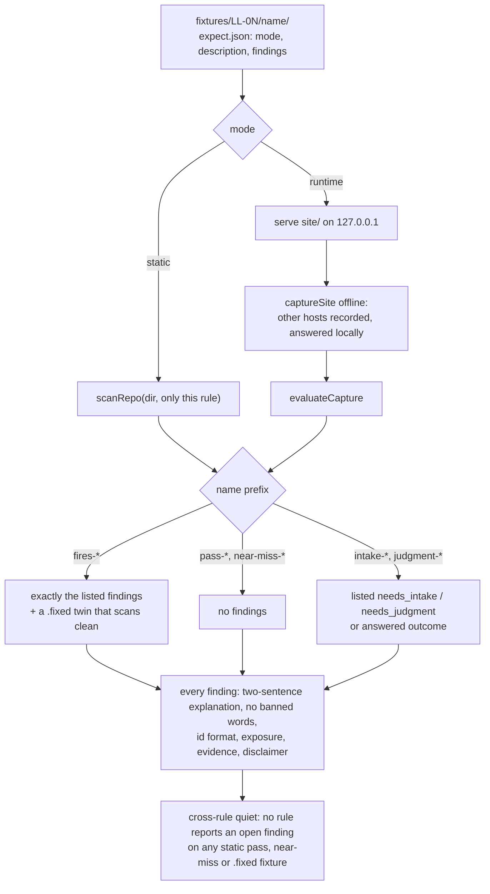
